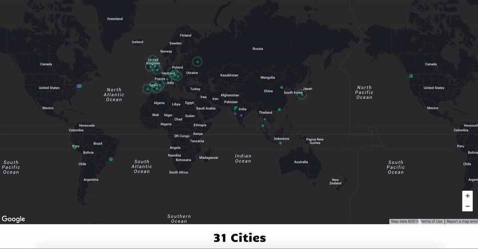
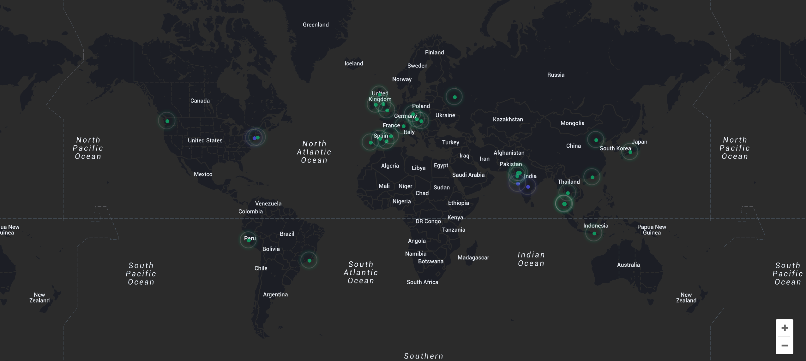
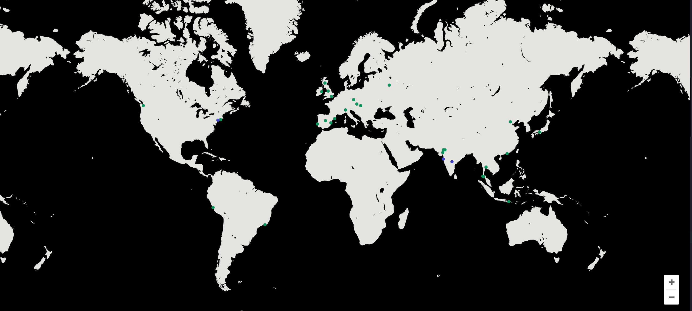
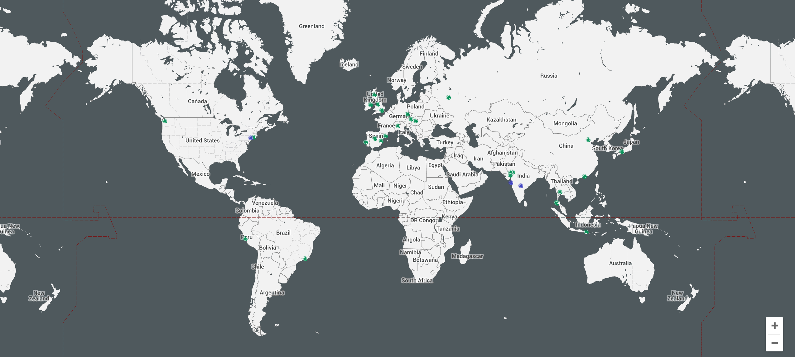
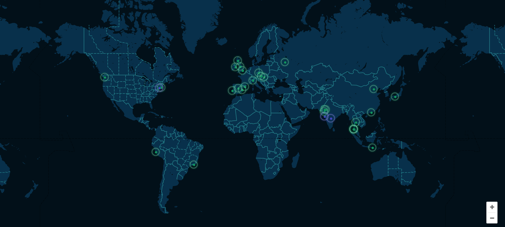
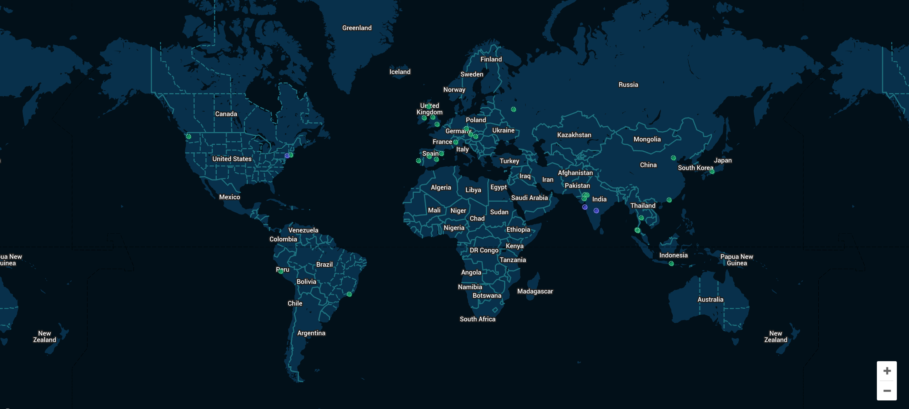
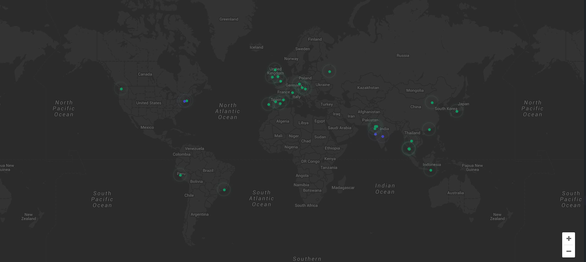

# Traveller :airplane: :helicopter: :rocket: :bike: :car: :truck: :bus:



Add a map on your site with every place that you have visited! [Demo](http://www.vinaygaba.com/traveller/demo.html)

---

Introduction
-----

My motivation behind creating Traveller was to create a [map for my website](http://www.vinaygaba.com/traveller/demo.html) that showcases the places that I have visited. I soon realized that there might be more people(developers) who would want to have a similar page on their site so I decided to put this up on Github.

As of now, it is a simple html page but going forward, I will be working on converting this into a React component so that it can be easily added to any web app.

I will try to be as elaborate as possible in giving instructions about how one might use this and customize it to suit their needs.


Usage
------
The code for the webpage is the [index.html](index.html) file.

First, you need to get a key to be able to use the Google Maps Javascript API. If you do not have one, go to the following [link](https://developers.google.com/maps/documentation/javascript/) and click on the "Get a Key" button on the top right corner. Once you have the key, find the following line in the index.html page and replace the placeholder with your key.
```
<script src="https://maps.googleapis.com/maps/api/js?key=GOOGLE_MAP_API_KEY&callback=initMap" async defer></script>
```

The html page parses a JSON file in order to know which points need to be populated on the map. The format of the JSON string needs to be as follows:

```JSON
[
  {
    "name":"Name of place",
    "lat":"Latitude",
    "lon":"Longitude",
    "purpose":"lived/travelled"
  },
  {
    "name":"Name of place",
    "lat":"Latitude",
    "lon":"Longitude",
    "purpose":"lived/travelled"
  },
  .
  .
  .
]
```
Right now I use two different markers to represent whether you lived in a city or were just travelling. If you do not like this, it would be pretty simple to remove this by making changes in the styles.css file. More about this in the Customizations section.

Example JSON files can be found in [data](data/) folder.
You can either save the JSON file in the same server or host the json file on a service like [myjson](http://myjson.com)

To specify which JSON file to use, find the ```$.getJSON(pathToJSONFile,function(..))``` method call in the html page and replace the jsonPath with the path to your JSON file.

And this is it! This is the only step that is required in order to see the populated world map that you see in the above screenshot.

<b>Note</b>: I understand that manually adding the locations can be a pain in the butt, especially for people who have travelled a lot. This will change soon as I am exploring alternate ways to do this(Facebook/Foursquare Checkins). I am also open to suggestions from you guys so feel free to use the Issue tracker to give me feedback.

Customizations
-----

I have added a few map styles that I personally liked in [mapstyles.js](js/mapstyles.js). To use them, import the js file in your html page(Already added in index.html page) and replace the palceholder text in the following line with one of the possibly map styles:

```
map.set('styles',NAME_OF_STYLE);

//Example
map.set('style',prestoMap);

```

Here is a list of the possible map styles that you can add by default.

###### prestoMap



###### google



###### cladme



###### cleanerMidnight



###### midnightCommander



###### shadesOfGray




You can very easily add more styles to the [mapstyles.js](js/mapstyles.js) file by going to [Snazzy Maps](https://snazzymaps.com/) and copy pasting the code for any of the map styles that you might like from the site.

To Do
-----
This is very early stages for this project and I definitely plan to make it more useful. I would love to get more people involved and so here are a list of things that I would appreciate getting some help on:

- Convert it into a React component
- Enter place names instead of lat/lng values int the json file. Will probably need to use the Geocoding API. (Under development. Check [link](index-geocode.html))
- Add more information when you hover over a marker. Something like an image from the trip could be useful. Or a side panel that loads when you click on a marker which contains all the images from the trip.

Inspiration
-------
Traveller was inspired by [Conquer.earth](https://conquer.earth) which was developed by Dustin Curtis. I wanted Traveller to be something that I can host on my own site.

Credits
-----------------
Author: Vinay Gaba (vinaygaba@gmail.com)

<a href="https://plus.google.com/+Vinaygaba">
  
</a>
<a href="https://twitter.com/vinaygaba">
  
</a>
<a href="https://www.linkedin.com/in/vinaygaba">
  
</a>


License
-------

    Copyright 2016 Vinay Gaba

    Licensed under the Apache License, Version 2.0 (the "License");
    you may not use this file except in compliance with the License.
    You may obtain a copy of the License at

       http://www.apache.org/licenses/LICENSE-2.0

    Unless required by applicable law or agreed to in writing, software
    distributed under the License is distributed on an "AS IS" BASIS,
    WITHOUT WARRANTIES OR CONDITIONS OF ANY KIND, either express or implied.
    See the License for the specific language governing permissions and
    limitations under the License.
